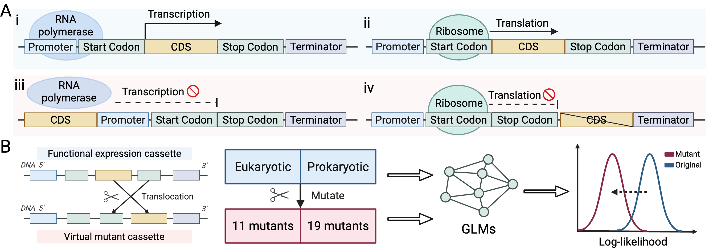

# GLM-Nullsette-Benchmark

This repository contains the processed Nullsettes benchmark and reference inference scripts used to evaluate whether genomic language models can distinguish functional synthetic expression cassettes from matched virtual loss-of-function mutants. The benchmark focuses on zero-shot mutation effect prediction in sequences that are functional but evolutionarily implausible.



## Benchmark overview

Each benchmark file contains 1,500 sequences. For every dataset, `nonmutant.txt` stores the original active expression cassettes and each `mutant_translocation*.txt` file stores the matched Nullsette mutants generated by translocating one key control element. Within a dataset, the FASTA headers and sequence order are preserved across files, so row `i` in a mutant file is paired with row `i` in `nonmutant.txt` for statistical testing.

The current release contains five processed datasets:

| Dataset folder | System | Upstream source | Nonmutant cassettes | Nullsette mutant types | Notes |
| --- | --- | --- | ---: | ---: | --- |
| `deboer/Abf1TATA` | Yeast | deBoer MPRA library | 1500 | 11 | Promoters containing Abf1/TATA features in randomized backgrounds |
| `deboer/pTpA` | Yeast | deBoer MPRA library | 1500 | 11 | Promoters containing polyT/polyA nucleosome-disfavoring features |
| `kosuri` | E. coli | Kosuri promoter-RBS library | 1500 | 19 | Rationally designed promoter-RBS pairs upstream of sfGFP |
| `lagator` | E. coli | Lagator promoter library | 1500 | 19 | Random promoter sequences upstream of sfGFP |
| `zahm` | Mammalian | Zahm TRE/minimal-promoter library | 1500 | 11 | Human/mouse TREs combined with minimal promoters |

For the benchmark logic itself:

- Eukaryotic cassettes have 11 valid single-component Nullsette translocations.
- Prokaryotic cassettes have 19 valid single-component Nullsette translocations.
- The translocation definitions are summarized in [database/README.md](database/README.md).

## Repository layout

```text
GLM-Nullsette-Benchmark/
|-- README.md
|-- environment.yml
|-- data/
|   |-- processed_data.zip
|   `-- example.txt
|-- database/
|   |-- README.md
|   |-- __init__.py
|   |-- ecoli_kosuri.py
|   |-- ecoli_lagator.py
|   |-- yeast_deboer.py
|   |-- mammlian_zahm.py
|   `-- pkls/
|-- model/
|   |-- alphagenome_infer.py
|   |-- evo1.py
|   |-- genslm.py
|   |-- hyenadna.py
|   |-- metagene1.py
|   |-- NT.py
|   |-- dnabert2.py
|   |-- generator.py
|   `-- utils/
|       |-- ll_calculation.py
|       `-- paired_mutation_test.py
`-- resource/
    `-- schematic.png
```

Useful starting points:

- [`database/`](database) stores the curated cassette architectures and promoter dictionaries used to build the benchmark.
- [`model/hyenadna.py`](model/hyenadna.py), [`model/genslm.py`](model/genslm.py), and [`model/alphagenome_infer.py`](model/alphagenome_infer.py) are the most configurable scoring scripts in the current repository.
- [`model/NT.py`](model/NT.py), [`model/dnabert2.py`](model/dnabert2.py), and [`model/generator.py`](model/generator.py) are lightweight legacy examples that currently use hard-coded paths for a single dataset slice.

## Quick start

The shortest end-to-end reproduction path is:

1. Create the environment.
2. Extract the processed benchmark inputs.
3. Run one inference script on the extracted `processed_data/` directory.
4. Compare `nonmutant` and mutant score files with the paired permutation test described below.

Example:

```bash
conda env create -f environment.yml
conda activate glm_eval
unzip data/processed_data.zip -d .
python model/hyenadna.py \
  --input-root "$PWD/processed_data" \
  --output-root "$PWD/inference_out_csv/HyenaDNA" \
  --model-name LongSafari/hyenadna-large-1m-seqlen-hf \
  --batch-size 1 \
  --device cuda
```

## Environment setup

```bash
git clone https://github.com/cellethology/GLM-Nullsette-Benchmark.git
cd GLM-Nullsette-Benchmark
conda env create -f environment.yml
conda activate glm_eval
```

## Preparing the benchmark inputs

The processed benchmark sequences used for scoring are distributed as a zip archive to keep the repository lightweight.

```bash
unzip data/processed_data.zip -d .
```

After extraction, the expected input layout is:

```text
processed_data/
|-- deboer/
|   |-- Abf1TATA/
|   |   |-- nonmutant.txt
|   |   |-- mutant_translocation1.txt
|   |   |-- ...
|   |   `-- mutant_translocation11.txt
|   `-- pTpA/
|       |-- nonmutant.txt
|       |-- mutant_translocation1.txt
|       |-- ...
|       `-- mutant_translocation11.txt
|-- kosuri/
|   |-- nonmutant.txt
|   |-- mutant_translocation1.txt
|   |-- ...
|   `-- mutant_translocation19.txt
|-- lagator/
|   |-- nonmutant.txt
|   |-- mutant_translocation1.txt
|   |-- ...
|   `-- mutant_translocation19.txt
`-- zahm/
    |-- nonmutant.txt
    |-- mutant_translocation1.txt
    |-- ...
    `-- mutant_translocation11.txt
```

Important format details:

- Although the files end in `.txt`, they are standard FASTA files.
- Each file contains exactly 1,500 sequences in the current release.
- Parameterized scoring scripts should be pointed to the extracted `processed_data/` directory via `--input-root`.
- Sequence pairing across `nonmutant` and mutant files is preserved by FASTA header and file order.

## Inspecting cassette

The curated cassette definitions can be imported directly from the `database` package:

```python
from database import deboer_database, zahm_database, kosuri_database, lagator_database

print(deboer_database["deBoer_cassette"].keys())
print(kosuri_database["kosuri_cassette"].keys())
print(zahm_database["zahm_cassette"].keys())
print(lagator_database["lagator_cassette"].keys())
```

These dictionaries expose the fixed cassette components such as promoter, RBS, start codon, CDS, 
stop codon, terminator, and etc. 

## Running model inference

General notes for all scoring scripts:

- For CLM- and MLM-style models, the output columns are usually `seqs` and `scores`.
- `alphagenome_infer.py` additionally writes `score_region_start` and `score_region_end` when `--score-subsequence` is used.
- Scores are model-specific and should be compared within a model family, not across different model families.

### HyenaDNA

[`model/hyenadna.py`](model/hyenadna.py) is a fully parameterized script for zero-shot scoring with Hugging Face HyenaDNA checkpoints.

```bash
python model/hyenadna.py \
  --input-root "$PWD/processed_data" \
  --output-root "$PWD/inference_out_csv/HyenaDNA" \
  --model-name LongSafari/hyenadna-large-1m-seqlen-hf \
  --batch-size 1 \
  --device cuda
```


### GenSLM

[`model/genslm.py`](model/genslm.py) expects a local GenSLM source tree and a downloaded checkpoint.

Requirements specific to this script:

- The GenSLM source tree is expected at `./genslm/genslm`.
- A checkpoint must be provided either with `--weights-path` or via `--model-cache-dir`.

Example:

```bash
python model/genslm.py \
  --input-root "$PWD/processed_data" \
  --output-root "$PWD/inference_out_csv/GenSLM" \
  --model-id genslm_2.5B_patric \
  --weights-path /absolute/path/to/patric_2.5b_epoch00_val_los_0.29_bias_removed.pt \
  --batch-size 1 \
  --device cuda
```

### AlphaGenome

[`model/alphagenome_infer.py`](model/alphagenome_infer.py) scores sequences with AlphaGenome by averaging predicted RNA-seq activity over a selected region of the input sequence.

Requirements specific to this script:

- The local AlphaGenome research repository is expected at `./alphagenome_research`.
- If `--checkpoint-path` is not supplied, the script downloads the requested checkpoint from Hugging Face.
- If authentication is needed for the checkpoint download, set `HF_TOKEN` in the environment before running the script.
- `--score-subsequence` is used to locate the CDS region for scoring.

Basic example:

```bash
python model/alphagenome_infer.py \
  --input-root "$PWD/processed_data" \
  --output-root "$PWD/inference_out_csv/AlphaGenome" \
  --organism homo_sapiens \
  --use-all-rna-tracks \
  --device gpu
  --score-subsequence ATCG...
```

Paper-aligned note:

- In the manuscript, AlphaGenome scores are computed by averaging RNA-seq predictions over the CDS positions of each cassette.
- To reproduce that setting exactly, pass the dataset-specific CDS sequence with `--score-subsequence`.
- The CDS sequences are stored in the database definitions under [`database/`](database). If `--score-subsequence` is omitted, the script averages over the full inserted sequence instead.

### Evo1

[`model/evo1.py`](model/evo1.py) scores each FASTA file in an input directory and writes one tab-separated output file per input file.

```bash
python model/evo1.py \
  --input_dir "$PWD/processed_data/kosuri" \
  --output_dir "$PWD/inference_out_csv/Evo1/kosuri" \
  --model_name evo-1-131k-base \
  --batch_size 1 \
  --device cuda
```

This script assumes the upstream Evo package is already installed and importable.

### METAGENE-1

[`model/metagene1.py`](model/metagene1.py) runs causal language model scoring on every FASTA file in a dataset directory.

```bash
python model/metagene1.py \
  --input_dir "$PWD/processed_data/deboer/Abf1TATA" \
  --output_dir "$PWD/inference_out_csv/METAGENE-1"
```

### Legacy single-dataset scripts

The following scripts were kept as minimal single-dataset examples:

- [`model/NT.py`](model/NT.py)
- [`model/dnabert2.py`](model/dnabert2.py)
- [`model/generator.py`](model/generator.py)

They require manual editing of `dir_paths` and `out_root_path` if you want to sweep additional datasets.


## Score definitions and interpretation

The repository uses different scoring rules for different model classes:

- Causal language models use mean next-token log-likelihood, implemented in [`model/utils/ll_calculation.py`](model/utils/ll_calculation.py) as `compute_ll_clm`.
- Masked language models use mean token log-probability from the unmasked MLM logits, implemented as `compute_llr_mlm`.
- AlphaGenome uses mean predicted RNA-seq activity over the selected scoring region.

Because these scores come from different objectives and inference procedures, their absolute values should not be interpreted on a common numerical scale across model families. The benchmark should therefore be evaluated within each model family by comparing mutant scores against their matched nonmutant scores.

## Reproducing the statistical test

The one-sided paired permutation test used in the manuscript is implemented in [`model/utils/paired_mutation_test.py`](model/utils/paired_mutation_test.py). For a given model and dataset:

1. Load `nonmutant.csv`.
2. Load one matched `mutant_translocation*.csv`.
3. Run the test with `alternative="less"` because mutants are expected to receive lower scores than nonmutants.
4. Repeat for all mutation types in the dataset.
5. Apply multiple-testing correction across the tested mutation types for that model and dataset.
6. Compute success rate as the fraction of mutation types with corrected `p < 0.05`.

Minimal example:

```python
from pathlib import Path
import pandas as pd
from model.utils.paired_mutation_test import paired_permutation_test

root = Path("inference_out_csv/HyenaDNA/hyenadna-large-1m-seqlen-hf/kosuri")
wt = pd.read_csv(root / "nonmutant.csv", sep="\t")["scores"].to_numpy()

for mutant_file in sorted(root.glob("mutant_translocation*.csv")):
    mut = pd.read_csv(mutant_file, sep="\t")["scores"].to_numpy()
    p_value = paired_permutation_test(
        wt,
        mut,
        num_permutations=10000,
        alternative="less",
        seed=0,
    )
    print(mutant_file.name, p_value)
```

## Raw data provenance

This repository distributes processed benchmark-ready inputs. The original upstream resources used to curate the benchmark are:

- Kosuri expression cassette backbone: [Addgene 47441](https://www.addgene.org/47441/)
- Lagator promoter dataset: [Thermoters repository](https://github.com/szarma/Thermoters)
- deBoer promoter library: [GEO GSE104878](https://www.ncbi.nlm.nih.gov/geo/query/acc.cgi?acc=GSE104878)
- Zahm promoter library: [GEO GSE271608](https://www.ncbi.nlm.nih.gov/geo/query/acc.cgi?acc=GSE271608)

The manuscript describes the dataset-specific filtering used to select the 1,500 nonmutant cassettes included in this release.

## Reference
[1] Kosuri, Sriram, et al. "Composability of regulatory sequences controlling transcription and translation in Escherichia coli." Proceedings of the National Academy of Sciences 110.34 (2013): 14024-14029. <br>
[2] Vaishnav, Eeshit Dhaval, et al. "The evolution, evolvability and engineering of gene regulatory DNA." Nature 603.7901 (2022): 455-463. <br>
[3] Zahm, Adam M., et al. "A massively parallel reporter assay library to screen short synthetic promoters in mammalian cells." Nature Communications 15.1 (2024): 10353. <br>
[4] de Boer, Carl G., et al. "Deciphering eukaryotic gene-regulatory logic with 100 million random promoters." Nature Biotechnology 38.1 (2020): 56-65.


## Acknowledgements

We acknowledge the valuable contributions to genomic language modeling made by the authors of the following repositories:
[Evo1](https://github.com/evo-design/evo), [Evo2](https://github.com/ArcInstitute/evo2/tree/main),
[Nucleotide Transformer](https://github.com/instadeepai/nucleotide-transformer),
[DNABERT-2](https://github.com/MAGICS-LAB/DNABERT_2),
[GENERator](https://github.com/GenerTeam), [METAGENE-1](https://github.com/metagene-ai),
[Caduceus](https://github.com/kuleshov-group/caduceus), [GPN](https://github.com/songlab-cal/gpn/tree/main),
[GENA-LM](https://github.com/AIRI-Institute/GENA_LM), [gLM2](https://github.com/TattaBio/gLM2), [PDLLM](https://github.com/zhangtaolab/Plant_DNA_LLMs),
[GENERanno](https://www.biorxiv.org/content/10.1101/2025.06.04.656517v1), [GPN-Promoter](https://www.biorxiv.org/content/10.1101/2025.02.11.637758v1.full), 
[GenSLM](https://github.com/ramanathanlab/genslm), [HyenaDNA](https://arxiv.org/abs/2306.15794), [AlphaGenome](https://www.nature.com/articles/s41586-025-10014-0).
