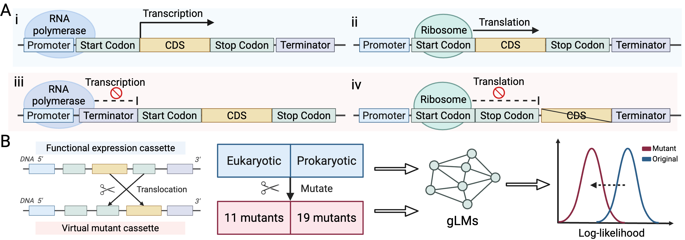

# GLM-Nullsette-Benchmark
This is a repository of scripts for reproducing benchmarking GLM on Nullsette.



## Installation
```
git clone https://github.com/cellethology/GLM-Nullsette-Benchmark.git
cd GLM-Nullsette-Benchmark
conda env create -f environment.yml
conda activate glm_eval
```
## Inference data
Example data is in `data/` directory. For inference data used in the paper,
please unzip the `data/processed_data.zip` file.

## Expression cassette data
You will find expression cassette data stored in `database` directory.
It can be easily imported using the following script.
```python
from database import deboer_database, zahm_database, kosuri_database, lagator_database
```

## Model inference script
Inference script for several representation models are in `model` directory.


## Acknowledgements
We acknowledge the valuable contributions to genomic language modeling made by the authors of the following repositories:
[Evo1](https://github.com/evo-design/evo), [Evo2](https://github.com/ArcInstitute/evo2/tree/main), 
[Nucleotide Transformer](https://github.com/instadeepai/nucleotide-transformer), 
[DNABERT-2](https://github.com/MAGICS-LAB/DNABERT_2), 
[GENERator](https://github.com/GenerTeam), [METAGENE-1](https://github.com/metagene-ai), 
[Caduceus](https://github.com/kuleshov-group/caduceus), [GPN](https://github.com/songlab-cal/gpn/tree/main), 
[GENA-LM](https://github.com/AIRI-Institute/GENA_LM), [gLM2](https://github.com/TattaBio/gLM2), [PDLLM](https://github.com/zhangtaolab/Plant_DNA_LLMs).